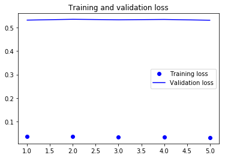

### Background 

In this project, I build a convolutional neural network that could classify any image that has human or dog face. If the image is of a human and not a dog, the algorithm will provide an estimate of the dog breed that is most resembling.

The code is written in Python 3 and Keras with Tensorflow backend all presented in Jupyter Notebook. AWS EC2 gpu instance has been used model training.

If you'd like to use this notebook to do any re-training on the dataset you can grab it at the links below.

Dog Images
wget https://s3-us-west-1.amazonaws.com/udacity-aind/dog-project/dogImages.zip; unzip dogImages.zip; rm dogImages.zip

Human Images
wget http://vis-www.cs.umass.edu/lfw/lfw.tgz; tar -xvzf lfw.tgz; rm lfw.tgz

##CNN architecture

I decided to experiment with the Resnet50 network. I passed the bottleneck features into a GlobalAveragePooling2D layer, which was then followed by a Dropout layer with a fairly large rate. This did a decent job helping with the overfitting issue. 
The data was then passed into a Dense layer of 133 nodes, 1 for each breed, with a softmax activation. i used Adamax with learning rate of 0.002 which allows slow but steady learning.

